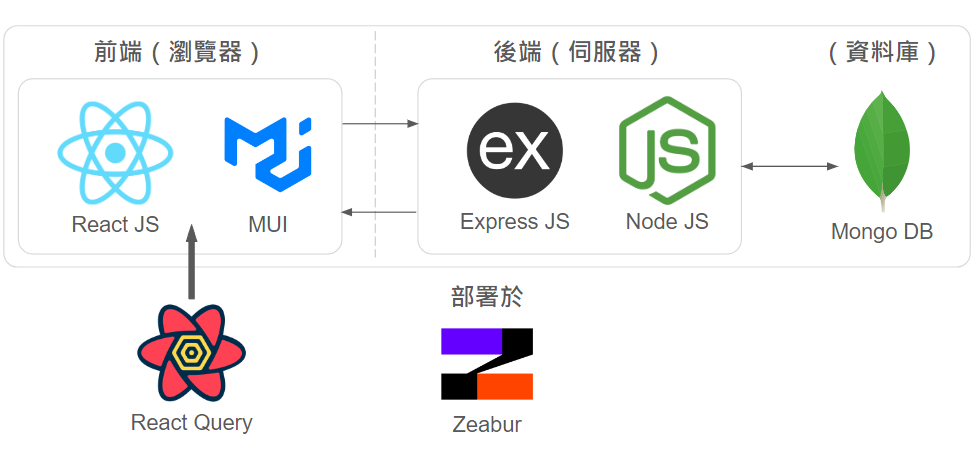

# 應用基因演算法進行題庫選題於平行測驗建置

2024年下學期「人工智慧」期末專題作業。前端使用React JS、react query以及MUI框架完成，後端則使用Node JS以及其框架Express JS完成，資料庫採用非關聯式資料庫MongoDB，前後端均部署於Zeabur平台上。
1. [投影片說明](https://docs.google.com/presentation/d/1bKv9PazLfLrsA85l2YbB4VndDy17RulkHrkfv9y4t0Q/edit?usp=sharing)
2. [專題操作網站](https://ga-exam-item-selection.zeabur.app/)
